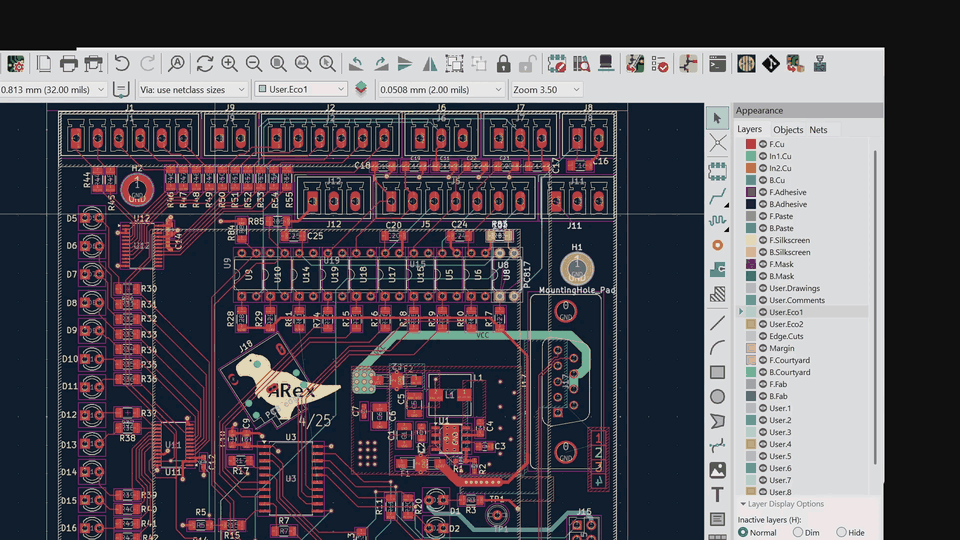

# k2g — KiCad to GCode

**CAM for making PCBs on a hobby CNC.** k2g reads the board open in KiCad and writes the
GCode that drills and cuts it out: holes, oblong slots, board outline with breakaway
tabs.

It is not a generic CAM package. It knows what a PCB is — plated and non-plated holes,
pad stacks, board outline, cutouts — and what your machine is, so the questions it asks
are about *machining a board*, not about polygons and offsets.

Written in Rust. Runs as a desktop application beside KiCad and talks to it live over
KiCad's IPC API, so there are no Gerber or Excellon files to export and re-import: edit
the board, hit refresh, get a new program.



<sub>A board in KiCad, then k2g: the generated program, the tooling and rack schedule,
the drill map, the toolpath in 3D, and the profiles that drive it.</sub>

> [!WARNING]
> **Pre-release.** k2g generates code that drives a spindle. Read every program before
> you run it, and air-cut anything new. See [Status](#status) for what is unfinished — in
> particular, **bottom-side machining is selectable in the UI but is not yet applied**,
> and a bottom-side step currently produces a top-side (mirrored) program.

---

## What it does

**Drilling**

- Plated and non-plated holes, grouped by finished size, with plating allowance
- Oblong / slotted holes, either as an overlapping drill chain or routed as a slot,
  carrying the pad's true orientation
- Picks real tools from your stock, and says so when nothing in stock can make a feature
- Schedules the tool rack — ATC slots where the machine has them, prompted manual
  changes where it does not
- Feeds and speeds derived per tool, clamped to the spindle's real range

**Routing**

- Board outline with breakaway tabs, distributed over the outline's sides (longest side
  gets the most), with optional mouse bites
- Internal cutouts
- Optional finishing pass

**The machine is yours to describe**

- **CNC profiles** hold the dialect. Every GCode word k2g emits comes from a template you
  can edit — see the [GCode template language](schemas/docs/gcode-template-language.md).
  No GCode is hardcoded in the application, so an unusual controller is a profile, not a
  patch.
- **Fixture profiles** hold the physical setup: work coordinate system, which board
  corner is X0/Y0, backing board, retract and safe heights.
- **Toolset profiles** hold what is loaded in the rack.
- **Machining profiles** are an ordered list of steps, each binding one CNC, one fixture
  and one toolset.

**Seeing it before you cut**

- **Board** — the stitched outline, holes and slots
- **3D** — the actual toolpath, coloured per tool, over a solid board
- **Code** — the generated program
- **Tooling** and **Rack** — which tool makes which feature, and where it lives

## Status

k2g does its main job — drill a board and cut it out — and is being tested on real
hardware. What is **not** done:

| Area | State |
| --- | --- |
| **Bottom-side machining** | Selectable per step and reported in the job sidebar, but **not applied**: a bottom-side step emits the same program as a top-side one. Do not use it. |
| Copper isolation milling | Not started |
| Engraving | Not started; planned for from the outset |
| Tab nudging | Tabs land where the distribution algorithm puts them. The job stores per-tab offsets, but nothing sets them yet. |
| Arc-preserving offsets | Outline offsets tessellate arcs |
| KiCad plugin action | `plugin.json` is present but its entry point is not implemented — run k2g as a standalone application |

## Requirements

- **Windows** — the UI renders in WebView2. Linux is not currently tested.
- **KiCad 9 or later**, running, with a board open and the IPC API enabled
  (*Preferences → Plugins → enable the KiCad API*), then restarted.
- **Rust** (stable) to build.

## Build and run

```sh
git clone https://github.com/adarwoo/k2g
cd k2g
cargo run --release
```

There is no installer yet — the build produces an ordinary executable.

| Environment variable | Effect |
| --- | --- |
| `RUST_LOG=debug` | Verbose logging, also visible in the in-app **Logs** screen |
| `KICAD_API_SOCKET` | Use an explicit KiCad IPC socket instead of discovering one |
| `K2G_KICAD_SINGLE_INSTANCE=1` | Skip the scan for sibling KiCad instances |

**On multiple KiCad instances:** KiCad serves one fixed API socket, and running instances
are not individually addressable over it. With several KiCads open, k2g talks to whichever
one owns the socket.

## Documentation

| Document | What it covers |
| --- | --- |
| [Specification](schemas/docs/Specification.md) | What the application is meant to do |
| [Architecture](schemas/docs/architecture.md) | How it is put together |
| [GCode template language](schemas/docs/gcode-template-language.md) | Writing CNC profile templates |
| [GCode engine](schemas/docs/gcode-engine.md) | How a program is assembled |
| [Operation planner](schemas/docs/operation-planner.md) | Tool selection, ordering, placement |

## Contributing

Issues and pull requests are welcome. The schemas under `schemas/` are the source of
truth for persisted data and for much of the UI — read
[architecture.md](schemas/docs/architecture.md) before changing one.

## Licence

Copyright © 2026 Bill Arreckx.

k2g is free software: you can redistribute it and/or modify it under the terms of the
**GNU General Public License, version 3**, as published by the Free Software Foundation.

It is distributed in the hope that it will be useful, but **WITHOUT ANY WARRANTY**;
without even the implied warranty of MERCHANTABILITY or FITNESS FOR A PARTICULAR PURPOSE.
See [LICENSE](LICENSE), or <https://www.gnu.org/licenses/gpl-3.0.html>, for the full
terms.

In short: use it, change it, share it. If you distribute a modified version, it must also
be GPLv3 and its source must be available.

Bundled third-party components keep their own licences —
[kicad-ipc-rs](third_party/kicad-ipc-rs) (MIT, vendored fork) and
[three.js](assets/vendor) (MIT).
